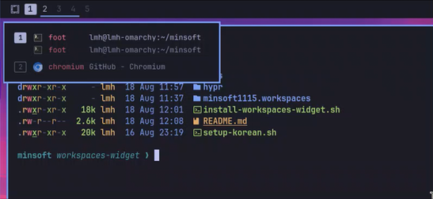

# omarchy-setup

[English](README.md) · **한국어**

[Omarchy](https://omarchy.org) (Arch + Hyprland) 머신을 새로 깔았을 때 돌리는 셋업 스크립트 모음.

각 스크립트는 **독립 실행**되고 **idempotent** 하다 — 여러 번 돌려도 안전하며,
이미 적용된 항목은 `건너뜀` 으로 표시된다. 기존 설정 파일은 고치기 전에
`*.bak.<타임스탬프>` 로 백업한다.

```
install.sh                 진입점 — clone + 선택 설치
scripts/                   개별 설치 스크립트
minsoft1115.workspaces/    Quickshell 플러그인 소스 (바 위젯 + 셸 서비스)
hypr/                      Hyprland Lua 조각 (설치 시 ~/.config/minsoft1115/hypr/ 로)
bash/                      alias·function 소스 (설치 시 ~/.config/minsoft1115/bash/ 로)
docs/                      스크립트 문서와 조사 기록
```

---

## 한 줄로 전부 (install.sh)

clone 부터 선택 설치까지 한 번에 한다.

```bash
curl -fsSL https://raw.githubusercontent.com/minsoft1115/omarchy-setup/main/install.sh | bash
```

내용을 먼저 보고 싶으면 `-o install.sh` 로 받아서 `less` 로 읽고 `bash install.sh` 로 돌린다.

`gum` 체크리스트가 뜬다 (스페이스로 토글, Enter 로 확정):

```
What should be set up? (space toggles, enter confirms)
> [ ] [installed / latest]   Korean input — right Alt for 한/영 · Omarchy menu opens in Latin
  [✓] [installed / outdated] Bash config — Alt-R history picker · fzf search and kill · delta diffs
  [✓] [not installed]        sudo-pop — privileged password prompts in a popup · polkit agent + sudo router · built from source
  [✓] [not installed]        Workspaces bar — hold Super to see which apps are where before switching
```

각 줄이 "깔려 있나 / 최신인가" 를 말하고, **할 일이 있는 것만 기본 선택**된다.
하나가 실패해도 나머지는 계속하고 끝에 요약이 나온다.

| 옵션 | 하는 일 |
|---|---|
| `--all` | 묻지 않고 전부 |
| `--only korean,sudo-pop` | 이름으로 지정 (`--list` 의 첫 열) |
| `--guards` / `--no-guards` | `zz-pkg-guards.sh` 답을 미리 정함 |
| `--list` | 설치 가능한 것과 현재 상태만 출력 |
| `--dry-run` | 무엇이 돌지만 보여 주고 실행 안 함 |
| `--dir <경로>` | clone 위치 변경 |
| `--remove` | 되돌리기. 같은 체크리스트가 **전부 해제된 상태**로 뜬다 |
| `--purge` | `--remove` 와 함께 쓰면 마지막에 clone 까지 삭제 |

clone 은 `~/.local/share/minsoft1115/omarchy-setup` 에 남는다. 스크립트들이 거기서 설치하므로,
소스를 고친 뒤 다시 돌리는 게 반영 방법이다. 다시 실행하면 pull 부터 한다.

자세한 내용은 [docs/install.md](docs/install.md) 참고 — 세 가지 상태, 체크박스의 의미,
되돌리기가 다른 점.

---

# 무엇이 설치되나

네 가지다. 각각 독립된 스크립트라 하나만 돌려도 되고, 무엇을 건드리는지·어떻게 도는지·
어디를 고칠 수 있는지는 옆의 문서에 있다.

| | | |
|---|---|---|
| **한글 입력** | 오른쪽 Alt 로 한/영 · tmux 와 겹치던 `Control+space` 해제 · Super+Space 메뉴가 영문으로 열림 | `setup-korean.sh` · [문서](docs/setup-korean.md) |
| **Bash 설정** | Alt-R 히스토리 피커 · fzf 검색과 종료 · delta diff · `pacman`·`yay` 를 실행하기 전에 묻는 선택 가드 | `install-bash-config.sh` · [문서](docs/bash-config.md) |
| **sudo-pop** | 권한 요청 비밀번호를 터미널이 아니라 팝업에서 받는다 — polkit 인증 에이전트와, 그 앞에서 순수 명령을 run0 로 보내는 sudo 라우터. [자기 저장소](https://github.com/minsoft1115/sudo-pop)가 따로 있고, 이 스텝이 clone 해서 빌드한다 | `install-sudo-pop.sh` · [문서](docs/sudo-pop.md) |
| **워크스페이스 바** | Super 를 누르고 있으면 어디에 뭐가 떠 있는지 보인다 · 포커스된 워크스페이스는 숫자 그대로 | `install-workspaces-widget.sh` · [문서](docs/workspaces-widget.md) |



체크리스트 없이 하나만 돌리려면:

```bash
git clone https://github.com/minsoft1115/omarchy-setup.git
cd omarchy-setup
./scripts/install-bash-config.sh install
```

저장소 안에서 실행한다 — 소스를 저장소에서 읽어 설치하기 때문이다. 대부분 `status`(기본),
`install`, `remove` 를 받고, 나머지는 각자의 `--help` 가 알려 준다. `install.sh` 를 이미 한 번
돌렸다면 clone 이 `~/.local/share/minsoft1115/omarchy-setup` 에 있다.

---

## 문서

이 README 는 무엇이 설치되고 어떻게 돌리는지까지만 적는다. 각 항목이 어떻게 동작하고 무엇을
건드리는지, 왜 그렇게 만들었는지는 위 표에서 링크한 문서에 있다.

### 참고 기록

스크립트는 아니고, Omarchy 가 어떻게 굴러가는지 조사해 둔 기록.

| 문서 | 내용 |
|---|---|
| [docs/quickshell-workspaces.md](docs/quickshell-workspaces.md) | Omarchy 4.0 바의 워크스페이스 인디케이터가 그려지는 방식 — 데이터 출처, 표시 규칙, 클릭 동작, 커스터마이즈 지점 |
| [docs/workspace-peek-design.md](docs/workspace-peek-design.md) | Super 홀드 미리보기의 설계와 실측 기록 — 키 바인딩 동작, release 유실, 팝업 크기 계산에서 틀렸던 것들 |
